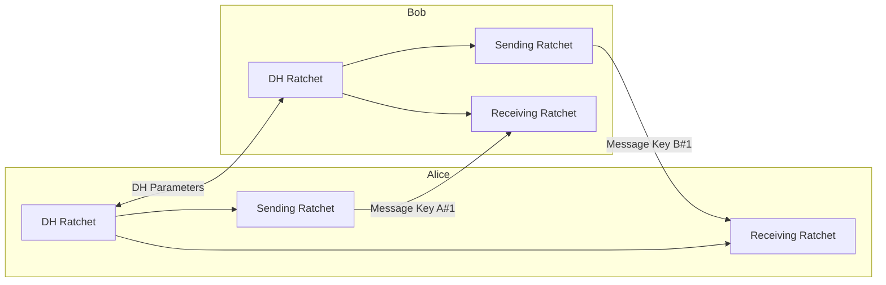

# Double Ratchet Messaging Encryption

## Table of Contents

1. [Introduction](#introduction)
2. [Challenges in Asynchronous Messaging](#challenges-in-asynchronous-messaging)
3. [Pre-Key Bundles and Triple Diffie–Hellman](#pre-key-bundles-and-triple-diffie-hellman)
4. [Key Updates and Per-Message Encryption](#key-updates-and-per-message-encryption)
5. [Ratchet Functions and KDF Ratchets](#ratchet-functions-and-kdf-ratchets)
6. [Double Ratchet Mechanism](#double-ratchet-mechanism)
7. [Synchronization Between Parties](#synchronization-between-parties)
8. [Security Properties](#security-properties)
9. [Application Layer Considerations](#application-layer-considerations)
10. [Diagram](#diagram)

---

## Introduction

Instant messaging systems support conversations that occur over the internet even when one party is offline or communication is asynchronous. In some cases, there may be long delays—sometimes up to six months—between messages. Such delays give attackers more time to attempt to break encryption keys and increase the risk that users forget or lose keys, which can make messages unreadable.

---

## Challenges in Asynchronous Messaging

Only part of the solution has been discussed so far. Pre-key bundles and the initial Triple Diffie–Hellman key exchange allow parties to establish keys asynchronously. One possible approach would be to use the initial key to secure all subsequent messages, similar to online shopping sessions. However, this is insecure. If a conversation lasts for several months and an attacker records all messages, compromising a single key would expose the entire conversation. Therefore, keys must be updated continuously rather than reused.

---

## Pre-Key Bundles and Triple Diffie–Hellman

Pre-key bundles are used to allow asynchronous key establishment. The initial Triple Diffie–Hellman key exchange provides a secure starting point for both parties to generate shared secrets without needing both parties to be online simultaneously.

---

## Key Updates and Per-Message Encryption

The frequency of key updates is critical. Signal, WhatsApp, and the Signal Protocol update the key for every single message. Each message is encrypted with a different key, making it extremely difficult for an attacker to compromise meaningful information. Even if one message is broken, attackers usually cannot decrypt others. The keys themselves are computationally difficult to break, making the system highly secure.

---

## Ratchet Functions and KDF Ratchets

At the core of the mechanism is a **ratchet function**, which moves in one direction and cannot be reversed, similar to a hash function. The **Key Derivation Function (KDF) ratchet** derives new message keys from the current key.

Starting from a root key:

1. The current key is passed through the KDF.
2. A new message key is generated.
3. The message is encrypted with this key.
4. For subsequent messages, the KDF is applied again to produce new keys.

This forms a one-way chain where breaking a key does not reveal past message keys.

---

## Double Ratchet Mechanism

To achieve **future secrecy**, a **Diffie–Hellman ratchet** is added to the KDF ratchet:

* Diffie–Hellman parameters are exchanged between parties.
* The KDF chain is updated using these parameters.
* Even if an attacker compromises a key, they cannot predict future keys without the new Diffie–Hellman parameters.

This combination of KDF chains and Diffie–Hellman updates is called the **double ratchet**, used in Signal and WhatsApp.

---

## Synchronization Between Parties

Two parties, Alice and Bob, maintain three ratchets each:

* **Diffie–Hellman ratchet**
* **Sending ratchet**
* **Receiving ratchet**

Message flow:

1. Alice updates her sending ratchet to generate a new message key.
2. She encrypts the message and sends it to Bob.
3. Bob updates his receiving ratchet to derive the same key and decrypts the message.
4. Bob repeats the process when sending messages to Alice.

Keys are deleted immediately after use, and missed messages are handled by temporarily storing keys until all messages arrive.

---

## Security Properties

The double ratchet provides:

* **Forward secrecy**: Breaking one key does not compromise past messages.
* **Self-healing**: Updating Diffie–Hellman parameters restores secrecy after a key compromise.
* **Asynchronous support**: Messages can arrive out of order and still be decrypted correctly.
* **Robustness**: Immediate deletion of used keys prevents exposure if a device is captured.

---

## Application Layer Considerations

Application-specific features, such as:

* Read receipts
* Delivery confirmations
* Multimedia messages (images, GIFs, video)

are wrapped using the same underlying ratchet-based encryption. Symmetric encryption algorithms like **AES** or **ChaCha** with authenticated encryption are used to ensure confidentiality and integrity.

---

## Diagram

---

