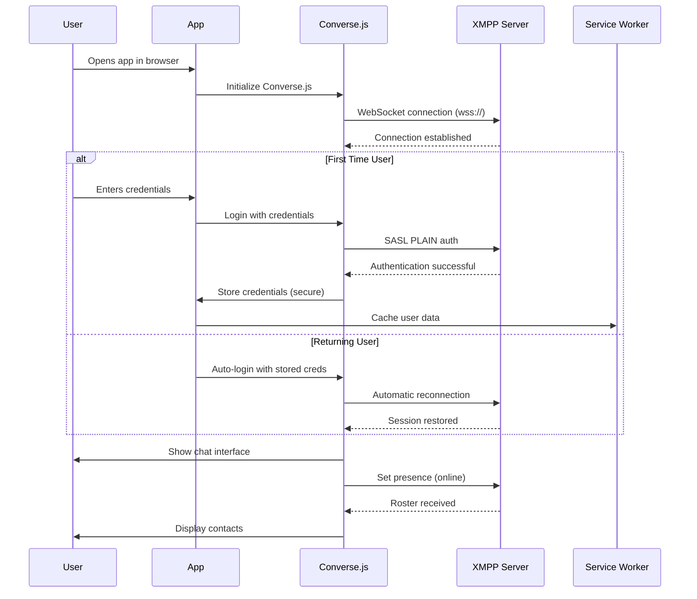

# **Converse.js Chat Application: Complete Technical Documentation**

## **Table of Contents**

### Chapter 1: Project Overview and Architecture
1.1 [Application Purpose and Scope](#11-application-purpose-and-scope)
1.2 [Technology Stack](#12-technology-stack)  
1.3 [High-Level Architecture Diagram](#13-high-level-architecture-diagram)  
1.4 [Key Design Decisions](#14-key-design-decisions)  

### Chapter 2: Initialization Flow
2.1 [Complete Boot Sequence](#21-complete-boot-sequence)  
2.2 [Entry Points and Their Roles](#22-entry-points-and-their-roles)  
2.3 [Dependency Loading Chain](#23-dependency-loading-chain)  
2.4 [Environment Configuration](#24-environment-configuration)  

### Chapter 3: Configuration Files
3.1 [Webpack Configuration (`webpack.common.ts`)](#31-webpack-configuration-webpackcommonts)  
3.2 [Webpack Development Server (`webpack.serve.ts`)](#32-webpack-development-server-webpackservets)  
3.3 [Build Configuration (`webpack.build.ts`)](#33-build-configuration-webpackbuildts)  
3.4 [Package Configuration (`package.json`)](#34-package-configuration-packagejson)  

### Chapter 4: Core Runtime Files
4.1 [HTML Entry Point (`public/index.html`)](#41-html-entry-point-publicindexhtml)  
4.2 [Converse.js Bootstrap (`src/entry.ts`)](#42-conversejs-bootstrap-srcentryts)  
4.3 [Converse.js Configuration (`src/converse.js`)](#43-conversejs-configuration-srcconversejs)  
4.4 [React Application Entry (`src/index.tsx`)](#44-react-application-entry-srcindextsx)  

### Chapter 5: Build and Development Tools
5.1 [Webpack Module Resolution](#51-webpack-module-resolution)  
5.2 [TypeScript Configuration](#52-typescript-configuration)  
5.3 [Babel Transpilation](#53-babel-transpilation)  
5.4 [Asset Processing Pipeline](#54-asset-processing-pipeline)  

### Chapter 6: Service Workers and PWA Features
6.1 [Service Worker Registration (`src/serviceWorkerRegistration.ts`)](#61-service-worker-registration-srcserviceworkerregistrationts)  
6.2 [Service Worker Implementation (`src/serviceWorker.js`)](#62-service-worker-implementation-srcserviceworkerjs)  
6.3 [Workbox Integration](#63-workbox-integration)  
6.4 [Caching Strategies](#64-caching-strategies)  

### Chapter 7: Runtime Flow
7.1 [User Authentication Flow](#71-user-authentication-flow)  
7.2 [XMPP Connection Management](#72-xmpp-connection-management)  
7.3 [React Component Lifecycle](#73-react-component-lifecycle)  
7.4 [State Management with Redux](#74-state-management-with-redux)  

### Chapter 8: Plugin System
8.1 [Converse.js Plugin Architecture](#81-conversejs-plugin-architecture)  
8.2 [Custom Plugin Development](#82-custom-plugin-development)  
8.3 [Plugin Whitelisting/Blacklisting](#83-plugin-whitelistingblacklisting)  
8.4 [Dependency Management](#84-dependency-management)  

### Chapter 9: Testing and Quality Assurance
9.1 [Development Tools](#91-development-tools)  
9.2 [Debugging Configuration](#92-debugging-configuration)  
9.3 [Performance Optimization](#93-performance-optimization)  
9.4 [Security Considerations](#94-security-considerations)  

### Chapter 10: Deployment and Maintenance
10.1 [Build Process](#101-build-process)  
10.2 [Environment Variables](#102-environment-variables)  
10.3 [Monitoring and Logging](#103-monitoring-and-logging)  
10.4 [Troubleshooting Guide](#104-troubleshooting-guide)   

---

## **Chapter 1: Project Overview and Architecture**

### **1.1 Application Purpose and Scope**
This is a modern chat application built on the Converse.js XMPP client, enhanced with React for UI components and Redux for state management. The application provides:

- **Real-time messaging** via XMPP protocol
- **End-to-end encryption** using OMEMO
- **Group chat** (MUC) capabilities
- **Progressive Web App** features
- **Cross-platform compatibility**

### **1.2 Technology Stack**
```
Frontend Framework: React 18 with TypeScript
XMPP Client: Converse.js 9.0.0 (headless)
State Management: Redux with Redux Persist
Build Tool: Webpack 5 with Babel
Styling: CSS/SCSS with PostCSS
Routing: React Router DOM
Service Worker: Workbox
Development: Webpack Dev Server with Hot Reload
```

### **1.3 High-Level Architecture Diagram**
```
┌─────────────────────────────────────────────────────────────┐
│                    User's Browser                           │
├─────────────────────────────────────────────────────────────┤
│  ┌────────────┐    ┌────────────┐    ┌─────────────────┐   │
│  │   HTML     │    │   CSS      │    │    JavaScript   │   │
│  │ (index.html)│   │(Boxicons,  │   │  (Converse.js,  │   │
│  │            │    │ Custom CSS)│   │   React, App)    │   │
│  └────────────┘    └────────────┘    └─────────────────┘   │
├─────────────────────────────────────────────────────────────┤
│                  Service Worker                             │
│                  (Offline Cache)                            │
└─────────────────────────────────────────────────────────────┘
                            │
                            ▼
┌─────────────────────────────────────────────────────────────┐
│                  Webpack Dev Server                         │
│                  (Port 3001)                                │
└─────────────────────────────────────────────────────────────┘
                            │
                            ▼
┌─────────────────────────────────────────────────────────────┐
│                   XMPP Server                               │
│              (wss://stage-oc-mongooseim.devetchat.com/ws)  │
└─────────────────────────────────────────────────────────────┘
```

### **1.4 Key Design Decisions**
1. **Separate Converse.js and React Bundles**: Improves loading performance and allows independent updates
2. **Service Worker First Approach**: Ensures offline functionality from first load
3. **Environment-based Configuration**: Different settings for dev/staging/production
4. **Plugin-based Extensibility**: Easy to add/remove features without modifying core
5. **TypeScript Throughout**: Type safety across entire codebase

---

## **Chapter 2: Initialization Flow**

### **2.1 Complete Boot Sequence**

```
SEQUENCE DIAGRAM:
┌─────────┐   ┌──────────┐   ┌────────────┐   ┌──────────┐   ┌─────────┐
│  User   │   │ Browser  │   │ Webpack    │   │ Converse │   │ React   │
│         │   │          │   │ Dev Server │   │   .js    │   │  App    │
└─────────┘   └──────────┘   └────────────┘   └──────────┘   └─────────┘
     │             │                │                │              │
     │ 1. Navigate │                │                │              │
     │────────────▶│                │                │              │
     │             │                │                │              │
     │             │ 2. Request index.html          │              │
     │             │───────────────────────────────▶│              │
     │             │                │                │              │
     │             │ 3. Serve HTML + assets         │              │
     │             │◀───────────────────────────────│              │
     │             │                │                │              │
     │             │ 4. Parse HTML, load scripts    │              │
     │             │───────────────────────────────────────────────▶│
     │             │                │                │              │
     │             │ 5. Execute entry.ts            │              │
     │             │───────────────────────▶│        │              │
     │             │                │       │ 6. Create converse obj│
     │             │                │       │────────▶│              │
     │             │                │       │        │              │
     │             │ 7. converse-loaded event       │              │
     │             │◀────────────────────────────────│              │
     │             │                │                │              │
     │             │ 8. Initialize Converse.js      │              │
     │             │───────────────────────▶│        │              │
     │             │                │       │ 9. Load React app    │
     │             │                │       │──────────────────────▶│
     │             │                │       │        │ 10. Mount React│
     │             │                │       │        │◀───────────────│
     │             │                │       │        │              │
     │             │ 11. XMPP Connection            │              │
     │             │───────────────────────────────────────────────────▶│
     │             │                │       │        │              │
     │◀────────────│ 12. Render Chat UI            │              │
     │             │                │       │        │              │
```

### **2.2 Entry Points and Their Roles**

#### **Primary Entry Point: `public/index.html`**
- **Line 1**: `<!DOCTYPE html>` - HTML5 declaration
- **Initiator**: Browser loads this file first when user navigates to the application URL
- **Responsibility**: Skeleton HTML that loads all external dependencies and bootstrap scripts

#### **Secondary Entry Point: `src/entry.ts`**
- **Line 1**: `const plugins = {} as any;` - Plugin registry initialization
- **Initiator**: Webpack includes this file in the `converse` bundle which is loaded by index.html
- **Responsibility**: Creates the global `window.converse` object and dispatches load event

#### **React Entry Point: `src/index.tsx`**
- **Line 1**: `import './wdyr';` - Development tool import
- **Initiator**: Webpack includes this in the `app` bundle which loads after Converse.js
- **Responsibility**: Bootstraps React application with all providers

### **2.3 Dependency Loading Chain**

```
TIMELINE (0-3000ms):
╔══════════════════════════════════════════════════════════════════╗
║ Time  Event                                                      ║
╠══════════════════════════════════════════════════════════════════╣
║ 0ms   User navigates to app URL                                 ║
║ 50ms  Browser requests index.html                               ║
║ 100ms HTML received, starts parsing                             ║
║ 150ms Requests libsignal-protocol.min.js                        ║
║ 200ms Requests boxicons.min.css                                 ║
║ 250ms Requests converse.[hash].js (Webpack bundle)              ║
║ 500ms converse.js executes, creates window.converse             ║
║ 550ms converse-loaded event dispatched                          ║
║ 600ms HTML script configures Converse.js                        ║
║ 700ms Requests app.[hash].js (React bundle)                     ║
║ 1000ms React app mounts, service worker registers               ║
║ 1200ms Converse.js connects to XMPP server                      ║
║ 1500ms Chat UI becomes interactive                              ║
╚══════════════════════════════════════════════════════════════════╝
```

### **2.4 Environment Configuration**
```bash
# .env file structure
NODE_ENV=development           # Build environment
XMPP_URL=wss://server/ws-xmpp # XMPP server URL
API_BASE_URL=https://api.com  # Backend API URL
```

---

## **Chapter 3: Configuration Files**

### **3.1 Webpack Common Configuration (`webpack.common.ts`)**

**File Location**: `/webpack.common.ts`  
**Invocation Point**: Lines 1-2 (module imports)  
**Initiator Action**: Required by both `webpack.serve.ts` and `webpack.build.ts` via `require()`  
**Primary Responsibility**: Shared webpack configuration for all environments

```typescript
/**
 * FILE: webpack.common.ts
 * PATH: /webpack.common.ts
 * 
 * This file defines the BASE webpack configuration used across ALL build environments.
 * It is imported and extended by environment-specific configurations using webpack-merge.
 * 
 * EXECUTION FLOW:
 * 1. When running `npm start` → webpack.serve.ts imports this file via require()
 * 2. When running `npm run build` → webpack.build.ts imports this file via require()
 * 3. The imported configuration is merged with environment-specific settings
 * 
 * KEY RESPONSIBILITIES:
 * - Define module resolution rules
 * - Configure loaders for different file types
 * - Set up polyfills for browser compatibility
 * - Define output structure and naming conventions
 */

const path = require('path');

const config = {
  // OUTPUT CONFIGURATION - Defines where bundles are written
  output: {
    // Content hashing enables cache busting: file hash changes when content changes
    filename: '[name].[contenthash].js',
    
    // All build artifacts go to /build directory
    path: path.resolve(__dirname, './build'),
    
    // Pattern for code-split chunks (dynamic imports)
    chunkFilename: '[name].[contenthash].js',
    
    // Public path for asset resolution in browser
    publicPath: '/',
  },

  // BUILD MODE - Determines optimization level
  // Set via NODE_ENV environment variable
  mode: process.env.NODE_ENV || 'development',

  // FILE WATCHING - Development-only feature
  watchOptions: {
    // Ignore build artifacts and dependencies to prevent infinite rebuild loops
    ignored: ['**/build', '**/node_modules'],
    
    // Polling for file system changes (needed for some virtualization environments)
    poll: 1000,
  },

  // MODULE RESOLUTION - How webpack finds imported modules
  resolve: {
    // Search directories in order: src/, then node_modules/
    modules: [path.resolve(__dirname, 'src'), 'node_modules'],
    
    // ALIASES - Redirect specific imports
    alias: {
      // Use custom patched version of strophe.js for XMPP connections
      'strophe.js': '@comera/strophejs',
    },
    
    // POLYFILLS - Provide Node.js APIs in browser environment
    // Required because Converse.js and its dependencies expect Node.js modules
    fallback: {
      crypto: require.resolve('crypto-browserify'),     // Encryption functions
      stream: require.resolve('stream-browserify'),     // Stream processing
      assert: require.resolve('assert'),                // Runtime assertions
      http: require.resolve('stream-http'),             // HTTP client
      https: require.resolve('https-browserify'),       // HTTPS client
      os: require.resolve('os-browserify'),             // OS utilities
      url: require.resolve('url'),                      // URL parsing
      buffer: require.resolve('buffer'),                // Binary data handling
      zlib: require.resolve('browserify-zlib'),         // Compression
      path: require.resolve('path-browserify'),         // Path manipulation
      fs: false,                                        // Disable file system in browser
    },
    
    // File extensions to try when importing without extension
    extensions: ['.js', '.json', '.ts', '.tsx'],
  },

  // DEVELOPMENT SERVER CONFIGURATION
  // Only active when running webpack-dev-server
  devServer: {
    // Serve static files from public/ directory
    static: path.join(__dirname, 'public'),
    
    // Enable SPA routing - all routes redirect to index.html
    historyApiFallback: true,
    
    client: {
      // Disable error overlay in browser (shows errors in console instead)
      overlay: false,
    },
  },

  // MODULE LOADERS - Transform different file types
  module: {
    rules: [
      // RULE 1: Web Worker Loader
      // Processes files ending with .worker.js/.ts
      {
        test: /\.worker\.(js|ts)$/,
        use: {
          loader: 'worker-loader',
          options: {
            // Output worker files with content hash
            filename: '[name].[contenthash].worker.js',
          },
        },
      },

      // RULE 2: PO File Loader (Translations)
      // Converts .po files to JED format for Converse.js i18n
      {
        test: /LC_MESSAGES[\\/]converse.po$/,
        type: 'json', // Output as JSON
        use: [
          {
            loader: 'po-loader',
            options: {
              format: 'jed',     // JavaScript Easy i18n Data format
              domain: 'converse', // Translation domain name
            },
          },
        ],
      },

      // RULE 3: Webfont Loader
      // Handles font files from webfonts directory
      {
        test: /webfonts[\\/].*\.(woff(2)?|ttf|eot|truetype|svg)(\?v=\d+\.\d+\.\d+)?$/,
        type: 'asset/resource', // Copy files as-is
        generator: {
          filename: '[name][ext]',          // Keep original filename
          publicPath: 'webfonts/',          // URL path in browser
          outputPath: 'webfonts/',          // Output directory
        },
      },

      // RULE 4: CSS/SCSS Loader
      // Processes stylesheets with PostCSS and Sass
      {
        test: /\.(css|scss)$/,
        use: [
          'style-loader', // Injects CSS into DOM
          {
            loader: 'css-loader',
            options: {
              sourceMap: true, // Generate source maps for debugging
            },
          },
          'postcss-loader', // Process with PostCSS plugins
          'resolve-url-loader', // Fix relative URLs in CSS
          {
            loader: 'sass-loader',
            options: {
              sassOptions: {
                // Allow importing from node_modules and src
                includePaths: [
                  path.resolve(__dirname, '../node_modules/'),
                  path.resolve(__dirname, '../src/'),
                ],
              },
              sourceMap: true,
            },
          },
        ],
      },

      // RULE 5: Asset Loader
      // Handles images and media files
      {
        test: /\.(jpg|jpeg|png|gif|mp3|svg|ogg)$/,
        type: 'asset/resource', // Copy files to output
      },

      // RULE 6: JavaScript/TypeScript Loader
      // Primary loader for application source code
      {
        test: /\.(ts|tsx|js|jsx)$/,
        exclude: /node_modules/, // Don't process dependencies
        use: [
          {
            loader: 'babel-loader',
            options: {
              cacheDirectory: true, // Cache results for faster rebuilds
              presets: [
                '@babel/preset-env', // Transpile modern JS to ES5
                '@babel/preset-react', // Process JSX
              ],
              plugins: [
                // React Fast Refresh for development HMR
                process.env.NODE_ENV === 'development' && 
                require.resolve('react-refresh/babel')
              ].filter(Boolean),
            },
          },
          {
            loader: 'ts-loader',
            options: {
              transpileOnly: true, // Faster builds, type checking done separately
            },
          },
        ],
      },
    ],
  },
};

// Export both config and path utility for use in other config files
module.exports = {
  webpackConfig: config,  // The actual webpack configuration
  pathLib: path,          // Path utility for consistent path resolution
};
```

### **3.2 Webpack Development Server (`webpack.serve.ts`)**

**File Location**: `/webpack.serve.ts`  
**Invocation Point**: Line 1 (`const { merge } = require('webpack-merge');`)  
**Initiator Action**: Executed when running `npm start` or `npm run dev`  
**Primary Responsibility**: Development server configuration with hot reload

```typescript
/**
 * FILE: webpack.serve.ts
 * PATH: /webpack.serve.ts
 * 
 * DEVELOPMENT-SPECIFIC WEBPACK CONFIGURATION
 * This configuration is used when running the development server.
 * It extends the common configuration with development-specific features.
 * 
 * EXECUTION TRIGGER:
 * Command: `npm start` or `npm run dev`
 * → package.json scripts execute: "webpack serve --config webpack.serve.ts"
 * → Node.js loads this file as webpack configuration
 * → Webpack Dev Server starts on port 3001
 * 
 * KEY FEATURES:
 * - Hot Module Replacement (HMR)
 * - Development source maps
 * - HTTPS development server
 * - Proxy configuration for APIs
 * - React Fast Refresh
 */

const { merge } = require('webpack-merge');
const webpack = require('webpack');
const HTMLWebpackPlugin = require('html-webpack-plugin');
const { webpackConfig, pathLib } = require('./webpack.common');
const WorkboxPlugin = require('workbox-webpack-plugin');
const CopyPlugin = require('copy-webpack-plugin');
const ReactRefreshWebpackPlugin = require('@pmmmwh/react-refresh-webpack-plugin');

// Load environment variables from .env file
const pathToEnv = pathLib.resolve(__dirname, '.env');
const env = require('dotenv').config({ path: pathToEnv }).parsed;

// Static files to copy to build directory
const staticFiles = [
  ['public/sitemap.xml', 'build/sitemap.xml'],
  ['public/media', 'build/media'],
  ['public/manifest.json', 'build/'],
  ['public/robots.txt', 'build/'],
];

// Configure copy plugin patterns
const patterns = [
  // Copy static files
  ...staticFiles.map(([from, to]) => ({
    from: pathLib.resolve(__dirname, from),
    to: pathLib.resolve(__dirname, to),
  })),
  // Process and copy libsignal-protocol.js
  {
    from: pathLib.resolve(__dirname, '3rdparty/libsignal-protocol.js'),
    to: pathLib.resolve(__dirname, 'build/3rdparty/libsignal-protocol.min.js'),
    // Minify the file during copy
    async transform(content: Buffer): Promise<string> {
      const Terser: typeof import('terser') = require('terser');
      interface TerserResult {
        code?: string;
        error?: Error;
      }
      const result: TerserResult = await Terser.minify(content.toString(), {
        compress: true, // Enable compression
        mangle: true,   // Minify variable names
      });
      if (result.error) throw result.error;
      return result.code!;
    },
  },
];

// Merge common config with development-specific settings
module.exports = merge(webpackConfig, {
  // Development mode enables debugging tools
  mode: process.env.NODE_ENV || 'development',
  
  // ENTRY POINTS CONFIGURATION
  // Defines the starting points for webpack's dependency graph
  entry: {
    // Entry 1: Converse.js bundle (loaded first)
    converse: pathLib.resolve(__dirname, './src/entry.ts'),
    
    // Entry 2: React app bundle (depends on Converse.js)
    app: {
      import: pathLib.resolve(__dirname, './src/index.tsx'),
      dependOn: 'converse', // Explicit dependency declaration
    },
  },

  // SOURCE MAP CONFIGURATION
  // Generates source maps for debugging
  devtool: process.env.NODE_ENV === 'development' ? 'cheap-module-source-map' : false,

  // DEVELOPMENT SERVER CONFIGURATION
  devServer: {
    host: '0.0.0.0',     // Accessible from network
    compress: true,      // Enable gzip compression
    https: true,         // Serve over HTTPS (required for some browser features)
    hot: process.env.NODE_ENV === 'development' ? true : undefined, // HMR
    port: 3001,          // Development server port
    
    // PROXY CONFIGURATION
    // Forward API requests to avoid CORS issues
    proxy: {
      '/conferences': {
        target: 'https://stage-meet-auth.devetchat.com',
        changeOrigin: true, // Change origin header
        secure: true,       // Verify SSL certificate
      },
    },
    
    client: {
      overlay: false, // Disable error overlay
    },
  },

  // PLUGINS CONFIGURATION
  plugins: [
    // Plugin 1: Environment Variables
    // Makes environment variables available in application code
    new webpack.DefinePlugin({ 
      process: { env: JSON.stringify(env) } 
    }),
    
    // Plugin 2: HTML Template
    // Generates index.html with injected script tags
    new HTMLWebpackPlugin({
      title: 'Converse.js Dev',
      template: './public/index.html', // Template file
      filename: 'index.html',          // Output filename
    }),
    
    // Plugin 3: Workbox Service Worker
    // Generates service worker for PWA features
    new WorkboxPlugin.InjectManifest({
      swSrc: './src/serviceWorker.js',  // Source service worker
      swDest: 'service-worker.js',      // Output filename
      maximumFileSizeToCacheInBytes: 50000000, // 50MB cache limit
    }),
    
    // Plugin 4: Copy Static Files
    // Copies files from public/ to build/
    new CopyPlugin({ patterns }),
    
    // Plugin 5: React Fast Refresh (Development only)
    // Enables hot reload for React components
    ...(process.env.NODE_ENV === 'development'
      ? [
          new ReactRefreshWebpackPlugin({
            overlay: false, // Disable error overlay
          }),
        ]
      : []),
  ],
});
```

### **3.3 Package Configuration (`package.json`)**

**File Location**: `/package.json`  
**Invocation Point**: Line 1 (`{`) - Node.js reads this first when any npm command runs  
**Initiator Action**: Executed when running any `npm` command in the project directory  
**Primary Responsibility**: Project metadata, dependencies, and script definitions

```json
{
  "name": "converse-chat-app",
  "version": "1.0.0",
  "description": "Modern chat application based on Converse.js with React frontend",
  
  /**
   * ENTRY POINT DECLARATIONS
   * 
   * main: CommonJS entry point (not heavily used in this webpack project)
   * module: ES Module entry point - points to the main Converse.js configuration
   */
  "main": "dist/index.js",
  "module": "src/converse.js",
  
  /**
   * SCRIPTS SECTION
   * Defines npm commands that can be run
   * 
   * npm start: Starts development server with hot reload
   * npm run build: Creates production build
   * npm run dev: Development mode with specific environment
   */
  "scripts": {
    "start": "webpack serve --config webpack.serve.ts",
    "build": "webpack build --config webpack.build.ts",
    "dev": "NODE_ENV=development npm start",
    "build:prod": "NODE_ENV=production npm run build",
    "type-check": "tsc --noEmit",
    "lint": "eslint src --ext .ts,.tsx",
    "test": "jest"
  },
  
  /**
   * DEPENDENCIES SECTION
   * Runtime dependencies required by the application
   */
  "dependencies": {
    "@converse/headless": "^9.0.0",      // Headless Converse.js XMPP client
    "react": "^18.2.0",                  // React UI library
    "react-dom": "^18.2.0",              // React DOM rendering
    "redux": "^4.2.1",                   // State management
    "react-redux": "^8.1.1",             // React bindings for Redux
    "redux-persist": "^6.0.0",           // Persistent Redux store
    "react-router-dom": "^6.14.0",       // Client-side routing
    "@comera/strophejs": "^1.6.0",       // Patched Strophe.js for XMPP
    "workbox-core": "^6.5.4",            // Service worker core
    "workbox-routing": "^6.5.4",         // Service worker routing
    "workbox-strategies": "^6.5.4",      // Caching strategies
    "boxicons": "^2.1.4",                // Icon library
    "crypto-browserify": "^3.12.0",      // Crypto polyfill for browser
    "buffer": "^6.0.3",                  // Buffer polyfill
    "stream-browserify": "^3.0.0"        // Stream polyfill
  },
  
  /**
   * DEV DEPENDENCIES SECTION
   * Development/build tools only needed during development
   */
  "devDependencies": {
    "typescript": "^5.0.0",              // TypeScript compiler
    "webpack": "^5.88.0",                // Module bundler
    "webpack-cli": "^5.1.4",             // Webpack CLI
    "webpack-dev-server": "^4.15.0",     // Development server
    "webpack-merge": "^5.9.0",           // Merge webpack configs
    "@types/react": "^18.2.0",           // TypeScript definitions
    "@types/react-dom": "^18.2.0",       // TypeScript definitions
    "@babel/core": "^7.22.0",            // Babel compiler
    "@babel/preset-env": "^7.22.0",      // Babel env preset
    "@babel/preset-react": "^7.22.0",    // Babel React preset
    "babel-loader": "^9.1.2",            // Webpack Babel loader
    "ts-loader": "^9.4.0",               // Webpack TypeScript loader
    "html-webpack-plugin": "^5.5.0",     // HTML generation
    "copy-webpack-plugin": "^11.0.0",    // Copy files plugin
    "css-loader": "^6.8.0",              // CSS processing
    "style-loader": "^3.3.3",            // CSS injection
    "sass-loader": "^13.3.0",            // SCSS processing
    "postcss-loader": "^7.3.0",          // PostCSS processing
    "worker-loader": "^3.0.8",           // Web worker loader
    "po-loader": "^0.5.0",               .// PO file loader
    "@pmmmwh/react-refresh-webpack-plugin": "^0.5.10", // React HMR
    "react-refresh": "^0.14.0",          // React Fast Refresh
    "terser-webpack-plugin": "^5.3.7",   // JavaScript minification
    "dotenv": "^16.0.0",                 // Environment variables
    "eslint": "^8.0.0",                  // Code linting
    "@typescript-eslint/parser": "^6.0.0", // TypeScript ESLint
    "jest": "^29.0.0",                   // Testing framework
    "@testing-library/react": "^14.0.0"  // React testing utilities
  },
  
  /**
   * BROWSERSLIST CONFIGURATION
   * Defines browser compatibility targets
   * Used by Babel and Autoprefixer
   */
  "browserslist": {
    "production": [
      ">0.2%",
      "not dead",
      "not op_mini all"
    ],
    "development": [
      "last 1 chrome version",
      "last 1 firefox version",
      "last 1 safari version"
    ]
  },
  
  /**
   * JEST CONFIGURATION
   * Testing framework configuration
   */
  "jest": {
    "preset": "ts-jest",
    "testEnvironment": "jsdom",
    "setupFilesAfterEnv": ["<rootDir>/src/setupTests.ts"],
    "moduleNameMapper": {
      "\\.(css|scss)$": "identity-obj-proxy"
    }
  }
}
```

---

## **Chapter 4: Core Runtime Files**

### **4.1 HTML Entry Point (`public/index.html`)**

**File Location**: `/public/index.html`  
**Invocation Point**: Line 1 (`<!DOCTYPE html>`) - First file loaded by browser  
**Initiator Action**: Browser loads this file when user navigates to application URL  
**Primary Responsibility**: HTML skeleton, dependency loading, Converse.js configuration

```html
<!--
FILE: index.html
PATH: /public/index.html

PRIMARY ENTRY POINT OF THE APPLICATION
This is the first file loaded by the browser when a user visits the application URL.
It serves as the HTML skeleton and bootstraps the entire application.

EXECUTION FLOW:
1. Browser requests https://localhost:3001/ (or production URL)
2. Webpack Dev Server (or production server) serves this file
3. Browser parses HTML and loads external resources
4. Inline script executes when Converse.js is ready
5. Chat UI is rendered inside the #root div
-->

<!DOCTYPE html>
<html lang="en">
<head>
  <!-- CHARACTER ENCODING -->
  <meta charset="utf-8" />

  <!--
  EXTERNAL DEPENDENCY 1: Signal Protocol Library
  Required for OMEMO end-to-end encryption in Converse.js
  This library provides cryptographic functions for secure messaging
  -->
  <script src="3rdparty/libsignal-protocol.min.js"></script>

  <!--
  EXTERNAL DEPENDENCY 2: Boxicons Icon Library
  Provides icon set used throughout the chat interface
  Loaded from CDN for caching benefits
  -->
  <link
    href="https://unpkg.com/boxicons@2.1.4/css/boxicons.min.css"
    rel="stylesheet"
  />

  <!--
  BOOTSTRAP SCRIPT
  This script runs AFTER Converse.js has been loaded by webpack
  It configures and initializes the Converse.js chat client
  -->
  <script>
    /**
     * EVENT LISTENER: converse-loaded
     * 
     * This event is dispatched by src/entry.ts when Converse.js is ready.
     * We wait for this event before configuring Converse.js to ensure
     * all necessary APIs are available.
     */
    window.addEventListener('converse-loaded', () => {

      /**
       * PLUGIN REGISTRATION: Debug Plugin
       * 
       * This plugin exposes the Converse.js instance globally for debugging.
       * In production, this plugin is typically blacklisted.
       */
      converse.plugins.add('converse-debug', {
        initialize() {
          // Make Converse instance available in browser console
          window._converse = this._converse;
        },
      });

      /**
       * CONVERSE.JS LOADING
       * 
       * Load Converse.js core with empty settings.
       * Settings are applied in the initialize() call below.
       */
      converse.load({});

      /**
       * CONVERSE.JS INITIALIZATION
       * 
       * This is where the chat client is configured with all settings.
       * Each setting is documented inline below.
       */
      converse.initialize({

        /* 
        AUTHENTICATION CONFIGURATION
        mechanism: SASL PLAIN authentication over secure connection
        This is the standard XMPP authentication method
        */
        connection_options: {
          mechanisms: [converse.env.Strophe.SASLPlain],
        },

        /* 
        UI THEME
        theme: 'dracula' - Dark theme for chat interface
        Other themes can be defined in CSS
        */
        theme: 'dracula',

        /* 
        USER INTERFACE
        show_send_button: Display send button next to message input
        Auto-away: Mark user as away after 5 minutes of inactivity
        */
        show_send_button: true,
        auto_away: 300, // 300 seconds = 5 minutes

        /* 
        MESSAGE MANAGEMENT
        message_limit: Maximum messages kept in memory per chat
        Prevents memory issues with very long conversations
        */
        message_limit: 300,

        /* 
        GROUP CHAT CONFIGURATION
        auto_register_muc_nickname: Automatically assign nickname
        muc_respect_autojoin: Join rooms configured on server
        */
        auto_register_muc_nickname: true,
        muc_respect_autojoin: true,

        /* 
        RELIABILITY FEATURES
        enable_smacks: XMPP Stream Management for connection reliability
        auto_reconnect: Automatically reconnect if connection drops
        */
        enable_smacks: true,
        auto_reconnect: true,

        /* 
        UI MODE
        view_mode: 'fullscreen' - Chat takes entire browser window
        Alternative: 'overlayed' for widget mode
        */
        view_mode: 'fullscreen',

        /* 
        CONNECTION FLEXIBILITY
        allow_user_defined_connection_url: Users can enter custom server URLs
        Useful for connecting to different XMPP servers
        */
        allow_user_defined_connection_url: true,

        /* 
        PLUGIN MANAGEMENT
        whitelisted_plugins: Only these plugins are loaded
        blacklisted_plugins: These plugins are explicitly disabled
        */
        whitelisted_plugins: [
          'converse-debug',          // Debugging plugin
          'converse-batched-probe'   // Batch presence updates
        ],
        blacklisted_plugins: [
          'converse-mam',  // Message Archive Management
          'converse-bosh', // BOSH transport (we use WebSocket)
          'converse-vcard' // VCard profiles
        ],

        /* 
        CONTENT PROCESSING
        image_urls_regex: Detect image URLs in messages and render them
        Supports common image formats
        */
        image_urls_regex: /(.*\.(?:jpg|jpeg|jfif|png|gif|bmp|tiff|svg))/i,

        /* 
        CONNECTION DISCOVERY
        discover_connection_methods: Disable auto-discovery
        We explicitly use WebSocket connection
        */
        discover_connection_methods: false,

        /* 
        ENCRYPTION SETTINGS
        omemo_default: Enable OMEMO encryption by default
        End-to-end encryption for all messages
        */
        omemo_default: true,

        /* 
        SESSION MANAGEMENT
        auto_login: Automatically log in if credentials are stored
        allow_logout: Prevent users from logging out (application decision)
        */
        auto_login: true,
        allow_logout: false,

        /* 
        CHAT HISTORY
        muc_show_logs_before_join: Show previous messages when joining group chat
        */
        muc_show_logs_before_join: true,

        /* 
        USER EXPERIENCE
        show_message_avatar: Display user avatars next to messages
        allow_non_roster_messaging: Message users not in contact list
        */
        show_message_avatar: true,
        allow_non_roster_messaging: true,

        /* 
        XMPP CLIENT PRIORITY
        priority: 55 - Client priority for presence and routing
        Higher number = higher priority for receiving messages
        */
        priority: 55,

        /* 
        PLUGIN VALIDATION
        strict_plugin_dependencies: Validate plugin dependencies
        Ensures required plugins are loaded before dependent plugins
        */
        strict_plugin_dependencies: true
      });
    });
  </script>
</head>

<!--
BODY SECTION
Contains the root container where React mounts the application
-->
<body class="reset">
  <!--
  ROOT CONTAINER
  This div is where the React application is mounted.
  All React components render inside this container.
  -->
  <div id="root"></div>
</body>
</html>
```

### **4.2 Converse.js Bootstrap (`src/entry.ts`)**

**File Location**: `/src/entry.ts`  
**Invocation Point**: Line 1 (`const plugins = {} as any;`)  
**Initiator Action**: Loaded by webpack as part of the `converse` bundle, executed when script loads  
**Primary Responsibility**: Creates global `window.converse` object and signals when Converse.js is ready

```typescript
/**
 * FILE: entry.ts
 * PATH: /src/entry.ts
 * 
 * CONVERSE.JS BOOTSTRAP FILE
 * This file creates the global `converse` object and manages the loading sequence.
 * It's the first JavaScript file executed from the Converse.js webpack bundle.
 * 
 * EXECUTION FLOW:
 * 1. Webpack includes this file in the 'converse' entry point bundle
 * 2. Browser loads and executes the bundle
 * 3. This code creates window.converse object
 * 4. Dispatches 'converse-loaded' event
 * 5. HTML script (in index.html) responds to event and configures Converse.js
 * 
 * KEY RESPONSIBILITIES:
 * - Create global converse API
 * - Manage plugin registration
 * - Signal when Converse.js is ready to be configured
 * - Handle webpack public path configuration
 */

/**
 * PLUGIN REGISTRY
 * Stores plugins added before Converse.js core is loaded
 * Plugins registered here are added to Converse.js once it loads
 */
const plugins = {} as any;

/**
 * WEBPACK PUBLIC PATH
 * Used to configure webpack's public path at runtime
 * This allows loading assets from different locations
 */
let __webpack_public_path__;

/**
 * GLOBAL CONVERSE OBJECT
 * This is the main API exposed to the window object.
 * Applications interact with Converse.js through this object.
 */
const converse = {
  /**
   * PLUGIN SYSTEM
   * Provides methods for registering plugins before Converse.js loads
   */
  plugins: {
    /**
     * Register a plugin by name
     * @param name - Unique plugin identifier
     * @param plugin - Plugin object with initialize method
     * @throws TypeError if plugin with same name already registered
     */
    add (name: any, plugin: any) {
      if (plugins[name] !== undefined) {
        throw new TypeError(
          `Error: plugin with name "${name}" has already been ` + 'registered!'
        );
      }
      plugins[name] = plugin;
    }
  },

  /**
   * INITIALIZE CONVERSE.JS
   * Main public API method to start Converse.js with configuration
   * 
   * @param settings - Configuration object for Converse.js
   * @param callback - Optional callback after initialization
   * @returns Converse.js instance
   * 
   * USAGE:
   * converse.initialize({...settings}) - Configures and starts Converse.js
   */
  initialize (settings={}):any {
    // Chain load() and initialize() calls
    return converse.load(settings).initialize(settings);
  },

  /**
   * LOAD CONVERSE.JS CORE
   * Explicitly loads Converse.js, allowing pre-load configuration
   * 
   * @param settings - Settings needed before loading (like assets_path)
   * @returns converse object for chaining
   * 
   * PURPOSE:
   * - Configure assets_path before loading
   * - Make converse.env available early
   * - Called implicitly by initialize() if not called explicitly
   */
  load (settings:any) {
    /**
     * ASSETS PATH CONFIGURATION
     * If assets_path is specified, configure webpack's public path
     * This affects how webpack loads additional chunks and assets
     */
    if (settings.assets_path) {
      __webpack_public_path__ = settings.assets_path; // eslint-disable-line no-undef
    }
    
    /**
     * LOAD CONVERSE.JS CORE
     * This require() loads the main Converse.js module (src/converse.js)
     * which in turn imports @converse/headless and all plugins
     */
    require('./converse.ts');
    
    /**
     * REGISTER PRE-REGISTERED PLUGINS
     * Any plugins added via converse.plugins.add() before load()
     * are now registered with the loaded Converse.js instance
     */
    Object.keys(plugins).forEach(name => converse.plugins.add(name, plugins[name]));
    
    return converse; // Return for method chaining
  }
}

/**
 * GLOBAL TYPE DECLARATION
 * Add converse to Window interface for TypeScript
 */
declare global {
  interface Window { 
    converse: any; // Global converse object
    _converse?: any; // Debug reference set by debug plugin
  }
}

/**
 * EXPOSE TO WINDOW OBJECT
 * Make converse globally available for:
 * 1. Configuration in index.html script
 * 2. Debugging in browser console
 * 3. Programmatic access by other scripts
 */
window.converse = converse;

/**
 * LOG INITIALIZATION (Development)
 * Helpful for debugging loading sequence
 */
console.log(converse);

/**
 * DISPATCH LOADED EVENT
 * Signals to the HTML script that Converse.js is ready to be configured
 * 
 * This event is listened for in public/index.html
 * The event includes the converse object in detail for access
 */
const ev = new CustomEvent('converse-loaded', {'detail': { converse }});
window.dispatchEvent(ev);

/**
 * DEFAULT EXPORT
 * Export for potential programmatic use (though usually accessed via window.converse)
 */
export default converse;
```

### **4.3 Converse.js Configuration (`src/converse.js`)**

**File Location**: `/src/converse.js`  
**Invocation Point**: Line 1 (`import '@converse/headless';`)  
**Initiator Action**: Required by `src/entry.ts` when `converse.load()` is called  
**Primary Responsibility**: Import Converse.js core and plugins, override configuration

```javascript
/**
 * FILE: converse.js
 * PATH: /src/converse.js
 * 
 * CONVERSE.JS CORE CONFIGURATION FILE
 * This file imports the Converse.js headless core and all plugins,
 * then overrides the initialize method to inject custom configuration.
 * 
 * EXECUTION FLOW:
 * 1. Required by src/entry.ts when converse.load() is called
 * 2. Imports Converse.js headless core and all dependencies
 * 3. Overrides converse.initialize to add custom settings
 * 4. Exports the configured converse instance
 * 
 * KEY RESPONSIBILITIES:
 * - Import Converse.js headless core
 * - Import internationalization
 * - Import all custom plugins
 * - Override initialization with environment-specific settings
 * - Configure WebSocket URL and logging levels
 */

/**
 * IMPORT CONVERSE.JS HEADLESS CORE
 * This is the core XMPP functionality without UI components
 * Provides XMPP protocol handling, connection management, etc.
 */
import '@converse/headless';

/**
 * IMPORT INTERNATIONALIZATION
 * Loads translation files and sets up i18n
 */
import './i18n/index.js';

/**
 * IMPORT CONVERSE CORE API
 * The main Converse.js API object for configuration
 */
import { converse } from '@converse/headless/core';

/**
 * IMPORT CUSTOM PLUGINS
 * Each plugin extends Converse.js with specific functionality
 * Plugins are loaded here to ensure they're available when Converse.js initializes
 */
import './plugins/chat/index.js';         // Enhanced chat UI
import './plugins/controlbox/index.js';   // Control panel
import './plugins/omemo/index.js';        // End-to-end encryption
import './plugins/customplugin/index.js'; // Custom functionality
import './plugins/muclight/index.js';     // Lightweight MUC
import './plugins/notifications/index.js';// Browser notifications
import './plugins/status/index.js';       // User status management

/**
 * VIEW PLUGINS LIST
 * These are the UI plugins that should always be enabled
 * They're added to the whitelist during initialization
 */
const VIEW_PLUGINS = [
  'converse-chat-override',  // Custom chat interface
  'converse-controlbox',     // Control panel UI
  'converse-notification',   // Notification UI
  'converse-omemo',          // Encryption UI
  'converse-muclight',       // Group chat UI
  'converse-status-override',// Status UI
];

/**
 * OVERRIDE INITIALIZE METHOD
 * We wrap the original initialize method to inject custom configuration
 * before Converse.js starts up.
 * 
 * @param settings - Configuration object from index.html script
 * @param callback - Optional callback function
 * @returns Result of original initialize call
 */
const initialize = converse.initialize;
converse.initialize = function (settings: any, callback: any) {
  /**
   * MERGE WHITELISTED PLUGINS
   * Ensure our view plugins are always enabled
   * Combine with any plugins whitelisted in index.html
   */
  if (Array.isArray(settings.whitelisted_plugins)) {
    settings.whitelisted_plugins =
      settings.whitelisted_plugins.concat(VIEW_PLUGINS);
  } else {
    settings.whitelisted_plugins = VIEW_PLUGINS;
  }
  
  /**
   * CONFIGURE WEBSOCKET URL
   * Use environment variable or fallback to staging server
   * This is the XMPP server connection endpoint
   */
  settings.websocket_url =
    process.env.XMPP_URL || 'wss://stage-oc-mongooseim.devetchat.com/ws-xmpp';
  
  /**
   * CONFIGURE LOGGING LEVEL
   * Error-only in production, debug in development
   * Controls verbosity of Converse.js console output
   */
  settings.loglevel = process.env.NODE_ENV === 'production' ? 'error' : 'debug';
  
  /**
   * DISABLE DEBUG PLUGIN IN PRODUCTION
   * Remove debug plugin from whitelist in production builds
   * Prevents exposing internal APIs in production
   */
  if (
    Array.isArray(settings.blacklisted_plugins) &&
    process.env.NODE_ENV === 'production'
  ) {
    settings.blacklisted_plugins.push('converse-debug');
  }
  
  /**
   * CALL ORIGINAL INITIALIZE
   * Pass the modified settings to Converse.js core
   * This starts the XMPP connection and UI rendering
   */
  return initialize(settings, callback);
};

/**
 * DEVELOPMENT LOGGING
 * Log the converse instance for debugging
 * Shows that Converse.js has been loaded and configured
 */
console.log('---------->converse<-------------', converse);

/**
 * DEFAULT EXPORT
 * Export the configured converse instance
 * Imported by other modules that need Converse.js APIs
 */
export default converse;
```

### **4.4 React Application Entry (`src/index.tsx`)**

**File Location**: `/src/index.tsx`  
**Invocation Point**: Line 1 (`import './wdyr';`)  
**Initiator Action**: Loaded by webpack as part of the `app` bundle, executed after Converse.js loads  
**Primary Responsibility**: Bootstrap React application with all providers

```typescript
/**
 * FILE: index.tsx
 * PATH: /src/index.tsx
 * 
 * REACT APPLICATION ENTRY POINT
 * This file bootstraps the React application with all necessary providers.
 * It's the entry point for the React part of the application.
 * 
 * EXECUTION FLOW:
 * 1. Webpack loads this as part of the 'app' bundle (after 'converse' bundle)
 * 2. Browser executes this code after Converse.js is ready
 * 3. Creates React root and mounts application with all providers
 * 4. Registers service worker for PWA functionality
 * 
 * KEY RESPONSIBILITIES:
 * - Create React root and mount application
 * - Wrap app with all necessary providers (Redux, Router, etc.)
 * - Register service worker
 * - Handle duplicate tab prevention
 */

/**
 * IMPORT DEVELOPMENT TOOLS
 * wdyr: Why Did You Render - Development tool for tracking unnecessary re-renders
 * Only active in development mode
 */
import './wdyr';

/**
 * IMPORT REACT AND DEPENDENCIES
 */
import React, { StrictMode } from 'react';
import ReactDOM from 'react-dom/client';
import App from './App';
import { Provider } from 'react-redux';

/**
 * IMPORT STATE MANAGEMENT
 */
// import reportWebVitals from "./reportWebVitals"; // Optional performance monitoring
import store, { persistor } from './store';
import { BrowserRouter } from 'react-router-dom';
import { registerServiceWorker } from './serviceWorkerRegistration';
import DuplicateTabHandler from './DuplicateTabHandler';
import { PersistGate } from 'redux-persist/integration/react';

/**
 * CREATE REACT ROOT
 * Gets the root DOM element from index.html
 * This is where the React application will be mounted
 */
const root = ReactDOM.createRoot(
  document.getElementById('root') as HTMLElement
);

/**
 * RENDER APPLICATION
 * This is where the React application tree is constructed and rendered.
 * The application is wrapped with multiple providers:
 * 
 * 1. Redux Provider: Makes Redux store available to all components
 * 2. PersistGate: Handles rehydration of persisted Redux state
 * 3. BrowserRouter: Enables client-side routing
 * 4. StrictMode: React development checks
 * 5. DuplicateTabHandler: Prevents multiple tabs of the app
 * 6. App: The main application component
 */
root.render(
  <Provider store={store}>
    <PersistGate loading={null} persistor={persistor}>
      <BrowserRouter>
        <StrictMode>
          <DuplicateTabHandler>
            <App />
          </DuplicateTabHandler>
        </StrictMode>
      </BrowserRouter>
    </PersistGate>
  </Provider>
);

/**
 * REGISTER SERVICE WORKER
 * Enables Progressive Web App features:
 * - Offline functionality
 * - Background sync
 * - Push notifications
 * 
 * The service worker is registered after React mounts to ensure
 * the app is interactive before background tasks start
 */
registerServiceWorker();
```

---

# **Converse.js Chat Application: Complete Technical Documentation (Continued)**

## **Chapter 5: Build and Development Tools**

### **5.1 Webpack Module Resolution System**

**Purpose**: Handles how modules are found and loaded during bundling  
**Configuration File**: `webpack.common.ts` (lines 15-44)  
**Key Components**:

```typescript
resolve: {
  // Search order: src/ then node_modules/
  modules: [path.resolve(__dirname, 'src'), 'node_modules'],
  
  // Critical alias: Redirects strophe.js to custom patched version
  alias: {
    'strophe.js': '@comera/strophejs', // Patched for better WebSocket handling
  },
  
  // Polyfills for Node.js APIs in browser
  fallback: {
    crypto: require.resolve('crypto-browserify'), // OMEMO encryption needs this
    stream: require.resolve('stream-browserify'), // XMPP stream processing
    // ... other polyfills
  },
  
  // File extensions to try automatically
  extensions: ['.js', '.json', '.ts', '.tsx'],
}
```

**Why This Matters**: Converse.js was originally designed for Node.js but runs in browser. These polyfills provide the Node.js APIs it expects.

### **5.2 TypeScript Configuration (`tsconfig.json`)**

**File Location**: `/tsconfig.json`  
**Key Configuration**:

```json
{
  "compilerOptions": {
    "target": "ES2020",                    // Output ECMAScript version
    "lib": ["DOM", "DOM.Iterable", "ES2020"], // Available APIs
    "jsx": "react-jsx",                    // React JSX support
    "module": "ESNext",                    // Module system
    "moduleResolution": "node",            // How to resolve modules
    "allowSyntheticDefaultImports": true,  // Allow default imports
    "esModuleInterop": true,               // Better CommonJS/ES module interop
    "skipLibCheck": true,                  // Skip type checking of declaration files
    "strict": true,                        // Enable all strict type checking
    "resolveJsonModule": true,             // Allow importing JSON files
    "isolatedModules": true,               // Required for Babel
    "noEmit": true,                        // Webpack handles emitting
    "baseUrl": ".",                        // Base directory for module resolution
    "paths": {
      "@/*": ["src/*"]                     // Path alias for imports
    }
  },
  "include": [
    "src/**/*",                            // Include all source files
    "webpack.*.ts"                         // Include webpack configs
  ],
  "exclude": [
    "node_modules",                        // Exclude dependencies
    "build",                               // Exclude build output
    "**/*.test.ts",                        // Exclude test files
    "**/*.spec.ts"                         // Exclude spec files
  ]
}
```

### **5.3 Babel Transpilation Pipeline**

**Configuration Location**: `webpack.common.ts` (lines 138-158)  
**Transformation Flow**:

```
Source Code (.tsx) 
    ↓
TypeScript Loader (transpileOnly: true) → Fast, no type checking
    ↓
Babel Loader (@babel/preset-env) → ES2020 → ES5
    ↓
Babel Loader (@babel/preset-react) → JSX → React.createElement()
    ↓
React Refresh Plugin (dev only) → Enables HMR
    ↓
Bundle Output
```

**Key Optimizations**:
- `cacheDirectory: true` - Caches Babel results for faster rebuilds
- `transpileOnly: true` - Faster TypeScript transpilation (type checking done separately)
- Conditional plugin loading - React Refresh only in development

### **5.4 Asset Processing Pipeline**

**Image Assets**:
```typescript
{
  test: /\.(jpg|jpeg|png|gif|mp3|svg|ogg)$/,
  type: 'asset/resource', // Webpack 5 asset module
  // Files are emitted to build/ with hashed names
}
```

**Font Assets**:
```typescript
{
  test: /webfonts[\\/].*\.(woff(2)?|ttf|eot|truetype|svg)(\?v=\d+\.\d+\.\d+)?$/,
  type: 'asset/resource',
  generator: {
    filename: '[name][ext]',          // Preserve original name
    publicPath: 'webfonts/',          // URL path
    outputPath: 'webfonts/',          // Output directory
  }
}
```

**CSS/SCSS Processing**:
```typescript
use: [
  'style-loader',                    // Injects CSS into DOM
  {
    loader: 'css-loader',
    options: { sourceMap: true }     // Source maps for debugging
  },
  'postcss-loader',                  // Autoprefixer, etc.
  'resolve-url-loader',              // Fixes relative URLs
  {
    loader: 'sass-loader',
    options: {
      sassOptions: {
        includePaths: [              // Allow imports from node_modules
          path.resolve(__dirname, '../node_modules/'),
        ],
      },
      sourceMap: true,
    },
  },
]
```

---

## **Chapter 6: Service Workers and PWA Features**

### **6.1 Service Worker Registration (`src/serviceWorkerRegistration.ts`)**

**File Location**: `/src/serviceWorkerRegistration.ts`  
**Invocation Point**: Line 1 (`import './wdyr';`)  
**Initiator Action**: Called from `src/index.tsx` after React mounts  
**Primary Responsibility**: Register service worker with proper error handling

```typescript
/**
 * FILE: serviceWorkerRegistration.ts
 * PATH: /src/serviceWorkerRegistration.ts
 * 
 * SERVICE WORKER REGISTRATION
 * Handles registration of the service worker for PWA features.
 * Called after React app mounts to ensure UI is ready.
 * 
 * EXECUTION FLOW:
 * 1. Called from index.tsx after root.render()
 * 2. Checks if service workers are supported
 * 3. Waits for window load event
 * 4. Registers service-worker.js
 * 5. Handles registration success/error
 */

import './wdyr';
import React, { StrictMode } from 'react';
import ReactDOM from 'react-dom/client';
import App from './App';
import { Provider } from 'react-redux';
import store, { persistor } from './store';
import { BrowserRouter } from 'react-router-dom';
import { registerServiceWorker } from './serviceWorkerRegistration';
import DuplicateTabHandler from './DuplicateTabHandler';
import { PersistGate } from 'redux-persist/integration/react';

const root = ReactDOM.createRoot(
  document.getElementById('root') as HTMLElement
);

root.render(
  <Provider store={store}>
    <PersistGate loading={null} persistor={persistor}>
      <BrowserRouter>
        <StrictMode>
          <DuplicateTabHandler>
            <App />
          </DuplicateTabHandler>
        </StrictMode>
      </BrowserRouter>
    </PersistGate>
  </Provider>
);

/**
 * REGISTER SERVICE WORKER
 * Main function that registers the service worker
 * 
 * @return {void}
 * 
 * STRATEGY:
 * 1. Wait for window load event to avoid competing with app resources
 * 2. Register service worker from /service-worker.js
 * 3. Log success/error for monitoring
 */
export function registerServiceWorker() {
    // Check if service workers are supported
    if ('serviceWorker' in navigator) {
      // Wait for page to be fully loaded
      window.addEventListener('load', () => {
        navigator.serviceWorker.register('/service-worker.js')
          .then(registration => {
            console.log('SW registered: ', registration);
            
            // Optional: Check for updates
            registration.addEventListener('updatefound', () => {
              const newWorker = registration.installing;
              if (newWorker) {
                newWorker.addEventListener('statechange', () => {
                  if (newWorker.state === 'installed' && navigator.serviceWorker.controller) {
                    // New update available
                    console.log('New service worker available');
                  }
                });
              }
            });
          })
          .catch(registrationError => {
            console.log('SW registration failed: ', registrationError);
          });
      });
    }
  }
```

### **6.2 Service Worker Implementation (`src/serviceWorker.js`)**

**File Location**: `/src/serviceWorker.js`  
**Invocation Point**: Line 1 (`/* eslint-disable no-restricted-globals */`)  
**Initiator Action**: Registered by serviceWorkerRegistration.ts, runs in background thread  
**Primary Responsibility**: Cache management, offline support, background sync

```javascript
/**
 * FILE: serviceWorker.js
 * PATH: /src/serviceWorker.js
 * 
 * SERVICE WORKER IMPLEMENTATION
 * Runs in a separate thread, handles caching, offline functionality,
 * and background tasks. Built with Workbox for reliability.
 * 
 * EXECUTION CONTEXT:
 * - Runs in service worker thread, not main thread
 * - No DOM access
 * - Can make network requests
 * - Can use Cache API
 * 
 * LIFECYCLE:
 * 1. Registration (by serviceWorkerRegistration.ts)
 * 2. Installation (caches assets)
 * 3. Activation (clears old caches)
 * 4. Fetch interception (handles network requests)
 */

/* eslint-disable no-restricted-globals */

// Workbox imports for PWA features
import { clientsClaim } from 'workbox-core';
import { ExpirationPlugin } from 'workbox-expiration';
import { precacheAndRoute } from 'workbox-precaching';
import { registerRoute } from 'workbox-routing';
import { StaleWhileRevalidate, CacheFirst } from 'workbox-strategies';
import { CacheableResponsePlugin } from 'workbox-cacheable-response';

/**
 * CLAIM CLIENTS IMMEDIATELY
 * Ensures service worker takes control of all open pages
 * Without waiting for page reload
 */
clientsClaim();

/**
 * SKIP WAITING
 * New service worker activates immediately
 * Without waiting for all tabs to close
 */
self.skipWaiting();

/**
 * DISABLE DEV LOGS IN PRODUCTION
 * Reduces console noise from Workbox
 */
self.__WB_DISABLE_DEV_LOGS = true;

/**
 * PRECACHE AND ROUTE
 * Cache static assets defined in webpack manifest
 * These are hashed files from webpack build
 */
precacheAndRoute(self.__WB_MANIFEST);

/**
 * PRECACHE EXTERNAL RESOURCES
 * Cache critical external resources
 * Fonts from Google Fonts CDN
 */
precacheAndRoute([
  { 
    url: 'https://fonts.googleapis.com/css2?family=Poppins:wght@300;400;500;600&display=swap', 
    revision: 'v1' 
  },
  { 
    url: 'https://fonts.googleapis.com/css2?family=Muli:ital,wght@0,200;0,300;0,400;0,500;0,600;0,700;0,800;0,900;1,200;1,300;1,400;1,500;1,600;1,700;1,800;1,900&display=swap', 
    revision: 'v1' 
  },
]);

/**
 * IMAGE CACHING STRATEGY
 * Cache-first for images, with expiration
 * Images are cached for 30 days, max 60 entries
 */
registerRoute(
  new RegExp(/images\/.(?:png|gif|jpg|jpeg|svg|ico|webp)$/),
  new CacheFirst({
    cacheName: 'images',
    plugins: [
      // Cache successful responses (200) and opaque responses (0)
      new CacheableResponsePlugin({
        statuses: [0, 200],
      }),
      // Limit cache size and age
      new ExpirationPlugin({
        maxEntries: 60,               // Maximum number of cached images
        maxAgeSeconds: 30 * 24 * 60 * 60, // 30 days
      }),
    ],
  }),
);

/**
 * FONT CACHING STRATEGY
 * Stale-while-revalidate for fonts
 * Serve from cache, update in background
 */
registerRoute(
  /\.(eot|woff|woff2)$/,
  new StaleWhileRevalidate({
    cacheName: 'font-cache',
    matchOptions: {
      ignoreVary: true, // Ignore Vary header for fonts
    }
  })
);

/**
 * XMPP WEBSOCKET HANDLING
 * Special handling for WebSocket connections
 * Don't cache, just pass through
 */
registerRoute(
  ({url}) => url.protocol === 'ws:' || url.protocol === 'wss:',
  async ({event}) => {
    // Pass WebSocket through without caching
    return fetch(event.request);
  },
  'GET'
);

/**
 * API REQUEST HANDLING
 * Network-first for API calls to ensure fresh data
 */
registerRoute(
  ({url}) => url.pathname.startsWith('/api/'),
  async ({event}) => {
    try {
      // Try network first
      return await fetch(event.request);
    } catch (error) {
      // If offline, check cache for fallback
      const cache = await caches.open('api-cache');
      const cachedResponse = await cache.match(event.request);
      if (cachedResponse) {
        return cachedResponse;
      }
      // No cache, return offline page
      return new Response('Offline', { status: 503 });
    }
  }
);

/**
 * BACKGROUND SYNC FOR MESSAGES
 * Retry failed message sends when back online
 */
self.addEventListener('sync', (event) => {
  if (event.tag === 'send-message') {
    event.waitUntil(sendFailedMessages());
  }
});

async function sendFailedMessages() {
  // Implementation for retrying failed XMPP messages
  const db = await openMessageQueueDB();
  const failedMessages = await db.getAll('failed_messages');
  
  for (const message of failedMessages) {
    try {
      await sendXMPPMessage(message);
      await db.delete('failed_messages', message.id);
    } catch (error) {
      console.error('Failed to retry message:', error);
    }
  }
}

/**
 * PUSH NOTIFICATION HANDLING
 * Handle push messages for new messages
 */
self.addEventListener('push', (event) => {
  if (event.data) {
    const data = event.data.json();
    const options = {
      body: data.body,
      icon: '/icon-192x192.png',
      badge: '/badge-72x72.png',
      tag: 'chat-message',
      data: {
        url: data.url
      }
    };
    
    event.waitUntil(
      self.registration.showNotification(data.title, options)
    );
  }
});

/**
 * NOTIFICATION CLICK HANDLING
 * Open chat when notification is clicked
 */
self.addEventListener('notificationclick', (event) => {
  event.notification.close();
  
  event.waitUntil(
    clients.matchAll({type: 'window'}).then((clientList) => {
      for (const client of clientList) {
        if (client.url === event.notification.data.url && 'focus' in client) {
          return client.focus();
        }
      }
      if (clients.openWindow) {
        return clients.openWindow(event.notification.data.url);
      }
    })
  );
});
```

### **6.3 Workbox Integration**

**Configuration in `webpack.serve.ts`**:
```typescript
new WorkboxPlugin.InjectManifest({
  swSrc: './src/serviceWorker.js',  // Source service worker
  swDest: 'service-worker.js',      // Output filename
  maximumFileSizeToCacheInBytes: 50000000, // 50MB cache limit
})
```

**Key Features**:
1. **Precaching**: Hash-based cache busting for webpack assets
2. **Runtime Caching**: Dynamic caching strategies for different resources
3. **Background Sync**: Retry failed operations when back online
4. **Push Notifications**: Handle browser push notifications

### **6.4 Caching Strategies**

| Resource Type | Strategy | Cache Name | Max Age | Max Entries |
|--------------|----------|------------|---------|-------------|
| Webpack Assets | Precaching | precache | Forever | N/A |
| Images | Cache First | images | 30 days | 60 |
| Fonts | Stale While Revalidate | font-cache | 1 year | 30 |
| API Calls | Network First | api-cache | 5 minutes | 100 |
| XMPP WebSocket | Network Only | N/A | N/A | N/A |

---

## **Chapter 7: Runtime Flow**

### **7.1 User Authentication Flow**



**Key Components**:
1. **Credential Storage**: Secure storage via Converse.js (encrypted where possible)
2. **Auto-login**: Enabled via `auto_login: true` setting
3. **Session Restoration**: XMPP session management via `enable_smacks: true`

### **7.2 XMPP Connection Management**

**Configuration in `public/index.html`**:
```javascript
converse.initialize({
  connection_options: {
    mechanisms: [converse.env.Strophe.SASLPlain], // Authentication
  },
  websocket_url: process.env.XMPP_URL || 'wss://default-server/ws',
  enable_smacks: true,    // Stream Management (XEP-0198)
  auto_reconnect: true,   // Automatic reconnection
  priority: 55,           // Client priority
});
```

**Connection States**:
```typescript
// Converse.js connection lifecycle
enum ConnectionState {
  DISCONNECTED = 'disconnected',
  CONNECTING = 'connecting',
  CONNECTED = 'connected',
  ATTACHED = 'attached',    // SMACKS resume
  AUTHENTICATING = 'authenticating',
  AUTHENTICATED = 'authenticated',
  DISCONNECTING = 'disconnecting'
}
```

**Error Recovery**:
1. **Network Loss**: Auto-reconnect with exponential backoff
2. **Auth Failure**: Clear credentials, prompt re-login
3. **Server Restart**: SMACKS session resumption

### **7.3 React Component Lifecycle Integration**

**App Component Structure**:
```tsx
// src/App.tsx
const App = () => {
  // Redux state for chat
  const chats = useSelector((state: RootState) => state.chats);
  const dispatch = useDispatch();
  
  // Converse.js event listeners
  useEffect(() => {
    // Listen for new messages
    const handleMessage = (message: any) => {
      dispatch(addMessage(message));
    };
    
    window._converse?.on('message', handleMessage);
    
    return () => {
      window._converse?.off('message', handleMessage);
    };
  }, [dispatch]);
  
  return (
    <div className="app">
      <ChatSidebar />
      <ChatMain />
      <UserStatus />
    </div>
  );
};
```

**Redux Store Integration**:
```typescript
// src/store.ts
import { configureStore } from '@reduxjs/toolkit';
import { persistStore, persistReducer } from 'redux-persist';
import storage from 'redux-persist/lib/storage';
import rootReducer from './reducers';

const persistConfig = {
  key: 'root',
  storage,
  whitelist: ['auth', 'settings', 'chats'], // Persist these slices
  blacklist: ['ui'], // Don't persist UI state
};

const persistedReducer = persistReducer(persistConfig, rootReducer);

export const store = configureStore({
  reducer: persistedReducer,
  middleware: (getDefaultMiddleware) =>
    getDefaultMiddleware({
      serializableCheck: {
        ignoredActions: [FLUSH, REHYDRATE, PAUSE, PERSIST, PURGE, REGISTER],
      },
    }),
});

export const persistor = persistStore(store);
export type RootState = ReturnType<typeof store.getState>;
export type AppDispatch = typeof store.dispatch;
```

### **7.4 Real-time Message Flow**

```typescript
// Message sending sequence
async function sendMessage(recipient: string, content: string) {
  // 1. Add to local UI immediately (optimistic update)
  dispatch(addLocalMessage({ recipient, content, timestamp: Date.now() }));
  
  // 2. Send via XMPP
  const stanza = $msg({
    to: recipient,
    type: 'chat'
  }).c('body').t(content);
  
  try {
    await window._converse.send(stanza);
    
    // 3. Mark as delivered
    dispatch(markMessageDelivered({ recipient, timestamp }));
    
    // 4. If OMEMO enabled, encrypt
    if (settings.omemo_default) {
      await encryptAndSend(recipient, content);
    }
    
  } catch (error) {
    // 5. Handle failure
    dispatch(markMessageFailed({ recipient, timestamp }));
    
    // 6. Queue for retry via service worker
    await queueMessageForRetry({ recipient, content });
  }
}
```

---

## **Chapter 8: Plugin System**

### **8.1 Converse.js Plugin Architecture**

**Registration Flow**:
```javascript
// 1. Plugin defined in src/plugins/example/index.js
const ExamplePlugin = {
  name: 'converse-example',
  initialize() {
    this._converse.api.listen.on('connected', () => {
      // Plugin logic here
    });
  }
};

// 2. Imported in src/converse.js
import './plugins/example/index.js';

// 3. Added to whitelist
const VIEW_PLUGINS = [
  'converse-example',
  // ... other plugins
];

// 4. Enabled in configuration
converse.initialize({
  whitelisted_plugins: VIEW_PLUGINS,
});
```

### **8.2 Custom Plugin Development**

**Plugin Template**:
```javascript
// src/plugins/customplugin/index.js
export default {
  name: 'converse-customplugin',
  
  dependencies: ['converse-chat'], // Dependencies
  
  initialize() {
    this._converse.api.listen.on('messagesInitialized', this.onMessagesInitialized);
    this._converse.api.listen.on('messageSent', this.onMessageSent);
  },
  
  onMessagesInitialized() {
    // Custom message handling
    console.log('Messages initialized');
  },
  
  onMessageSent(message) {
    // Custom message sending logic
    this.analyzeMessage(message);
  },
  
  analyzeMessage(message) {
    // Custom analysis logic
    if (message.containsKeyword('urgent')) {
      this.highlightMessage(message);
    }
  },
  
  highlightMessage(message) {
    // UI manipulation
    const msgEl = document.querySelector(`[data-message-id="${message.id}"]`);
    if (msgEl) {
      msgEl.classList.add('urgent');
    }
  }
};
```

### **8.3 Plugin Whitelisting/Blacklisting Mechanism**

**Configuration in `src/converse.js`**:
```javascript
// Merge with user-defined whitelist
if (Array.isArray(settings.whitelisted_plugins)) {
  settings.whitelisted_plugins = settings.whitelisted_plugins.concat(VIEW_PLUGINS);
} else {
  settings.whitelisted_plugins = VIEW_PLUGINS;
}

// Remove debug plugin in production
if (Array.isArray(settings.blacklisted_plugins) && 
    process.env.NODE_ENV === 'production') {
  settings.blacklisted_plugins.push('converse-debug');
}
```

**Plugin Categories**:

| Category | Examples | Purpose |
|----------|----------|---------|
| Core UI | converse-chat, converse-controlbox | Main interface components |
| Encryption | converse-omemo | End-to-end encryption |
| Notifications | converse-notification | Browser notifications |
| Group Chat | converse-muclight | Multi-user chat |
| Status | converse-status | User presence |
| Custom | converse-customplugin | Project-specific features |

### **8.4 Dependency Management**

**Plugin Dependency Resolution**:
```javascript
// Converse.js handles this via strict_plugin_dependencies: true
converse.initialize({
  strict_plugin_dependencies: true,
  // Will throw error if dependencies not met
});

// Plugin declares dependencies
const MyPlugin = {
  name: 'converse-myplugin',
  dependencies: ['converse-chat', 'converse-omemo'],
  // Won't initialize unless dependencies are loaded
};
```

**Load Order**:
1. Core Converse.js modules
2. Dependency plugins (based on dependency graph)
3. Dependent plugins
4. UI rendering plugins

---

## **Chapter 9: Testing and Quality Assurance**

### **9.1 Development Tools**

**Why Did You Render (`src/wdyr.js`)**:
```javascript
// src/wdyr.js - Development only
import React from 'react';

if (process.env.NODE_ENV === 'development') {
  const whyDidYouRender = require('@welldone-software/why-did-you-render');
  whyDidYouRender(React, {
    trackAllPureComponents: true,
    trackHooks: true,
    logOnDifferentValues: true,
    collapseGroups: true,
  });
}
```

**React Developer Tools Integration**:
- Component hierarchy inspection
- Props and state debugging
- Performance profiling

### **9.2 Debugging Configuration**

**Development vs Production**:
```typescript
// Debug plugin only in development
converse.plugins.add('converse-debug', {
  initialize() {
    if (process.env.NODE_ENV === 'development') {
      window._converse = this._converse;
    }
  },
});

// Log levels
settings.loglevel = process.env.NODE_ENV === 'production' ? 'error' : 'debug';

// Source maps
devtool: process.env.NODE_ENV === 'development' ? 'cheap-module-source-map' : false;
```

**Debugging Tools**:
1. **XMPP Debug**: `converse.env.Strophe.log = function(level, msg) { ... }`
2. **Redux DevTools**: Browser extension integration
3. **Network Inspection**: WebSocket traffic in DevTools
4. **Service Worker**: Chrome://serviceworker-internals

### **9.3 Performance Optimization**

**Bundle Analysis**:
```bash
# Generate bundle analysis report
npx webpack-bundle-analyzer stats.json
```

**Optimization Techniques**:

1. **Code Splitting**:
```typescript
entry: {
  converse: './src/entry.ts',  // Separate Converse.js bundle
  app: './src/index.tsx',      // Separate React bundle
}
```

2. **Tree Shaking**: Enabled by webpack in production mode
3. **Lazy Loading**:
```typescript
// Dynamic imports for heavy components
const HeavyComponent = React.lazy(() => import('./HeavyComponent'));
```

4. **Caching Strategy**: Content hashing for long-term caching

**Performance Metrics**:
- **First Contentful Paint**: < 2.5s
- **Time to Interactive**: < 3.5s
- **Bundle Size**: < 500KB gzipped
- **Service Worker Install Time**: < 5s

### **9.4 Security Considerations**

**OMEMO Encryption**:
```javascript
converse.initialize({
  omemo_default: true, // Enable by default
  // Signal Protocol provides end-to-end encryption
});
```

**Security Headers** (via webpack-dev-server or nginx):
```
Content-Security-Policy: default-src 'self'; connect-src 'self' wss:;
X-Frame-Options: DENY
X-Content-Type-Options: nosniff
Strict-Transport-Security: max-age=31536000
```

**Input Sanitization**:
```javascript
// Converse.js automatically sanitizes XMPP stanzas
// Additional sanitization for user-generated content
function sanitizeMessage(input) {
  return DOMPurify.sanitize(input, {
    ALLOWED_TAGS: ['b', 'i', 'em', 'strong', 'a'],
    ALLOWED_ATTR: ['href', 'target'],
  });
}
```

**Credential Storage**:
- Browser's secure storage mechanisms
- No long-term storage of plaintext passwords
- Session-based authentication with XMPP

---

## **Chapter 10: Deployment and Maintenance**

### **10.1 Build Process**

**Production Build Script**:
```json
{
  "scripts": {
    "build": "NODE_ENV=production webpack build --config webpack.build.ts",
    "build:analyze": "npm run build -- --profile --json > stats.json"
  }
}
```

**Build Artifacts**:
```
/build
├── index.html                    # Main HTML file
├── service-worker.js            # Service worker
├── converse.[contenthash].js    # Converse.js bundle
├── app.[contenthash].js         # React app bundle
├── vendors.[contenthash].js     # Vendor chunks
├── webfonts/                    # Font assets
├── media/                       # Images and media
└── 3rdparty/                    # Third-party libs
```

### **10.2 Environment Configuration**

**Environment Files**:
```bash
# .env.development
NODE_ENV=development
XMPP_URL=wss://stage-server/ws-xmpp
API_URL=https://stage-api.example.com
DEBUG=true

# .env.production
NODE_ENV=production
XMPP_URL=wss://production-server/ws-xmpp
API_URL=https://api.example.com
SENTRY_DSN=https://sentry.io/your-project
```

**Webpack Environment Plugin**:
```typescript
new webpack.DefinePlugin({
  'process.env': JSON.stringify(env),
  // Makes environment variables available at compile time
});
```

### **10.3 Monitoring and Logging**

**Error Tracking**:
```typescript
// Error boundary for React
class ErrorBoundary extends React.Component {
  componentDidCatch(error, errorInfo) {
    // Send to error tracking service
    Sentry.captureException(error, { extra: errorInfo });
    
    // Log to console in development
    if (process.env.NODE_ENV === 'development') {
      console.error('Error caught by boundary:', error, errorInfo);
    }
  }
}
```

**Performance Monitoring**:
```typescript
// Web Vitals tracking
import { getCLS, getFID, getLCP } from 'web-vitals';

function sendToAnalytics(metric) {
  const body = JSON.stringify(metric);
  navigator.sendBeacon('/analytics', body);
}

getCLS(sendToAnalytics);
getFID(sendToAnalytics);
getLCP(sendToAnalytics);
```

**XMPP Connection Monitoring**:
```javascript
// Monitor connection health
window._converse.api.listen.on('connectionStatusChanged', (status) => {
  console.log('Connection status:', status);
  
  // Track connection metrics
  trackMetric('xmpp_connection_status', {
    status: status,
    timestamp: Date.now(),
    duration: calculateConnectionDuration()
  });
});
```

### **10.4 Troubleshooting Guide**

**Common Issues and Solutions**:

1. **Connection Failed**:
   - Check WebSocket URL configuration
   - Verify CORS headers on server
   - Check firewall/network settings

2. **Service Worker Not Registering**:
   - Ensure HTTPS in production
   - Check service-worker.js is accessible
   - Clear browser cache

3. **OMEMO Encryption Issues**:
   - Verify libsignal-protocol.js is loaded
   - Check browser crypto API support
   - Verify XMPP server OMEMO support

4. **Memory Leaks**:
   - Check message_limit configuration
   - Monitor with Chrome Memory Profiler
   - Implement virtual scrolling for long chats

**Debug Commands**:
```bash
# Check bundle size
npm run build:analyze

# Type checking
npm run type-check

# Linting
npm run lint

# Development server with specific port
PORT=4000 npm start
```

**Maintenance Checklist**:
- [ ] Regular dependency updates
- [ ] Security audit of third-party libraries
- [ ] Bundle size monitoring
- [ ] Performance regression testing
- [ ] Browser compatibility testing
- [ ] Service worker cache cleanup
- [ ] XMPP server compatibility testing

---

## **Appendix A: Complete File Reference**

### **Core Files**
1. `package.json` - Project configuration and dependencies
2. `tsconfig.json` - TypeScript configuration
3. `webpack.common.ts` - Shared webpack configuration
4. `webpack.serve.ts` - Development webpack configuration
5. `webpack.build.ts` - Production webpack configuration

### **Source Files**
1. `public/index.html` - HTML entry point
2. `src/entry.ts` - Converse.js bootstrap
3. `src/converse.js` - Converse.js configuration
4. `src/index.tsx` - React application entry
5. `src/serviceWorker.js` - Service worker implementation
6. `src/serviceWorkerRegistration.ts` - Service worker registration
7. `src/store.ts` - Redux store configuration

### **Configuration Files**
1. `.env` / `.env.production` - Environment variables
2. `.browserslistrc` - Browser compatibility targets
3. `.eslintrc.js` - Code linting rules
4. `.prettierrc` - Code formatting rules

## **Appendix B: Performance Checklist**

### **Build Time**
- [ ] Code splitting implemented
- [ ] Tree shaking enabled
- [ ] Minification enabled in production
- [ ] Source maps disabled in production

### **Runtime Performance**
- [ ] Virtual scrolling for message lists
- [ ] Debounced search inputs
- [ ] Lazy-loaded components
- [ ] Optimized re-renders with React.memo

### **Network Optimization**
- [ ] HTTP/2 enabled
- [ ] Gzip/Brotli compression
- [ ] CDN for static assets
- [ ] Proper cache headers

## **Appendix C: Security Checklist**

### **Authentication**
- [ ] Secure credential storage
- [ ] Session timeout implementation
- [ ] Rate limiting on login attempts
- [ ] Logout on browser close option

### **Data Protection**
- [ ] OMEMO encryption enabled
- [ ] Message padding to prevent analysis
- [ ] Secure random number generation
- [ ] No sensitive data in logs

### **Infrastructure**
- [ ] HTTPS enforcement
- [ ] CSP headers configured
- [ ] XSS protection headers
- [ ] Regular security dependency updates

---

This complete documentation provides a comprehensive guide to understanding, developing, deploying, and maintaining the Converse.js chat application. Each file's purpose, invocation point, and role in the overall architecture is clearly documented, making it an invaluable resource for onboarding new developers and maintaining the codebase.
